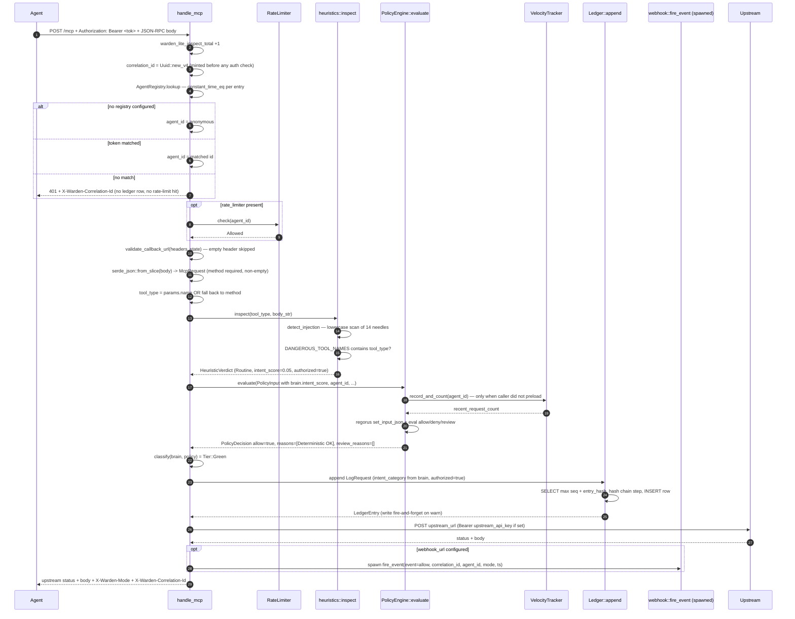
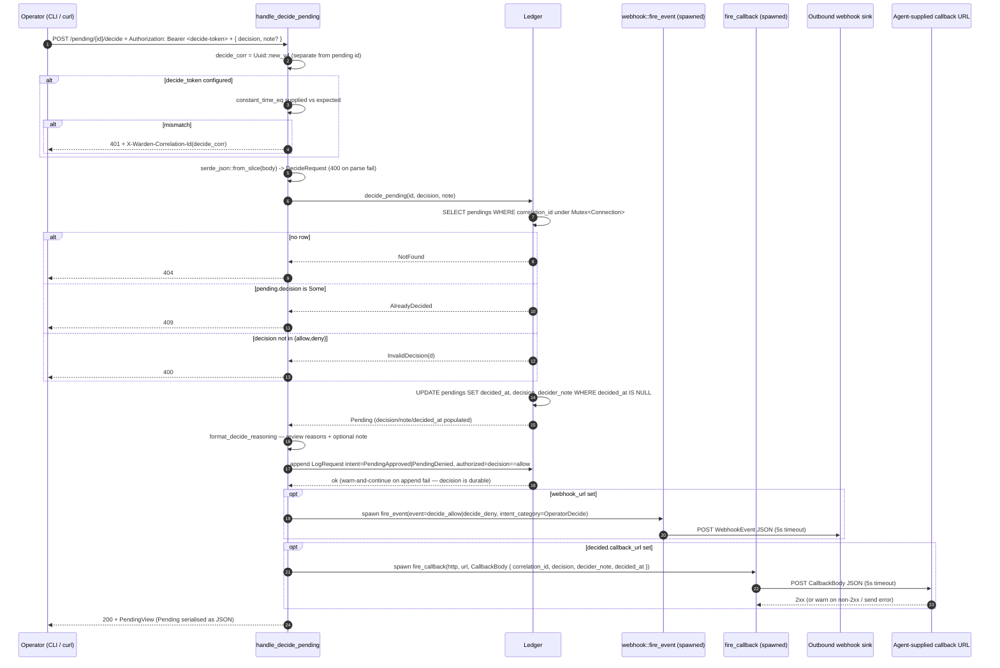
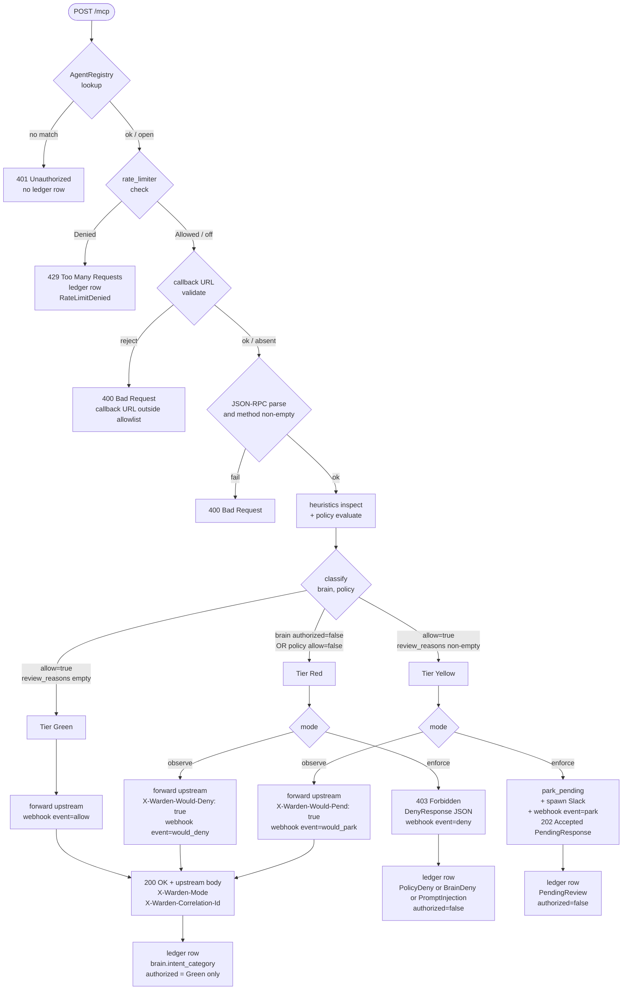

# warden-lite sequence diagrams

Five sequence diagrams covering the wire-level behaviour of the
single-binary OSS edition: boot, the Green-tier `POST /mcp` fast path,
Yellow-tier park with optional Slack + outbound webhook, operator
decide + async-HIL callback, and `warden-lite verify` chain-version
dispatch. One flowchart at the end captures the Brain/policy tier
classification with its `enforce` / `observe` branching.

The wire shapes mirror `warden-proxy` + `warden-ledger` (the full
edition's Layer 1 + Layer 4) but collapse into one process, so the
diagrams emphasise the boundaries that stay HTTP — the agent, the
upstream LLM/tool API, the operator, the Slack channel, and the SIEM
sink — and treat the embedded `heuristics`, `policy`, `ledger`, and
`rate_limit` modules as in-process actors.

## 1. Boot — `warden-lite start`

The startup sequence walks every fail-fast check that lives between
`main` and the first byte served, in the order they run. A typo in
`--upstream`, a missing `*.rego` file, a malformed
`WARDEN_LITE_AGENTS` registry, a callback-allowlist entry that isn't
a URL, or a bad `--webhook-url` all surface as a non-zero exit code
here — never as a 5xx on the first inbound request.

```mermaid
sequenceDiagram
    autonumber
    participant Op as Operator shell
    participant CLI as warden-lite (main)
    participant URL as reqwest::Url::parse
    participant Policy as PolicyEngine::from_dir
    participant Ledger as Ledger::open
    participant Reg as AgentRegistry::parse
    participant State as Arc&lt;AppState&gt;
    participant Prom as PrometheusBuilder
    participant Axum as axum::serve

    Op->>CLI: warden-lite start --upstream URL --policies DIR --ledger PATH ...
    CLI->>CLI: tracing_subscriber::fmt (JSON if WARDEN_LOG_FORMAT=json)
    CLI->>CLI: Cli::parse — flag/env merge via clap
    CLI->>URL: parse(cfg.upstream)
    alt parse error
        URL-->>CLI: Err
        CLI-->>Op: exit 1 (invalid upstream URL)
    end
    CLI->>Policy: from_dir(policies, velocity_window)
    Policy->>Policy: read_dir + add_policy for every *.rego
    alt no .rego files OR add_policy fails
        Policy-->>CLI: Err
        CLI-->>Op: exit 1 (policy load failed)
    end
    Policy-->>CLI: Arc&lt;PolicyEngine&gt; with regorus engine + VelocityTracker
    CLI->>Ledger: open(ledger_path)
    Ledger->>Ledger: pragma WAL + busy_timeout=5000
    Ledger->>Ledger: init_schema — CREATE TABLE entries + pendings
    Ledger->>Ledger: idempotent ALTERs — chain_version, correlation_id, callback_url
    Ledger-->>CLI: Arc&lt;Ledger&gt; (or exit 1 on sqlite error)
    CLI->>CLI: reqwest::Client::builder().timeout(upstream_timeout).build
    alt --agents set
        CLI->>Reg: parse(spec)
        Reg-->>CLI: AgentRegistry with N entries (or exit 1 on duplicate/empty)
    else --token set
        CLI->>Reg: single(token)
        Reg-->>CLI: AgentRegistry with bearer-agent
    else neither
        CLI->>CLI: agents = None (open access, agent_id=anonymous)
    end
    CLI->>CLI: parse callback_allowlist — every prefix must be a valid URL
    CLI->>CLI: parse webhook_url — reqwest::Url::parse or exit 1
    CLI->>CLI: build RateLimiter from RateLimitConfig (None when qps==0)
    CLI->>State: assemble AppState (policy, ledger, agents, mode, slack, callbacks, webhook, rate_limiter)
    CLI->>Prom: install_recorder
    Prom-->>CLI: PrometheusHandle (single global recorder)
    CLI->>CLI: describe_counter for warden_lite_inspect_total / verdicts_total / rate_limit_denied_total
    CLI->>Axum: build_router(state).route(/metrics, prom.render)
    CLI->>CLI: tracing::info — boot banner with mode + upstream + auth posture
    CLI->>Axum: TcpListener::bind(0.0.0.0:port)
    CLI->>Axum: tokio::select! axum::serve OR ctrl_c
    Note over Axum: serves /, /health, /readyz, /mcp,<br/>/pending, /pending/{id}, /pending/{id}/decide, /metrics
    Op->>Axum: ctrl-c
    Axum-->>CLI: shutdown
    CLI-->>Op: exit 0
```

## 2. Green-tier `POST /mcp` — bearer auth, rate-limit, brain + policy, forward

The fast path: an authenticated request whose tool name and payload
clear both the heuristic Brain and the Rego policy is forwarded
upstream and the response rides back through with `X-Warden-Mode` +
`X-Warden-Correlation-Id` stamped. Exactly one ledger row is written
per request at this orchestration step — Lite collapses the full
edition's two-row pattern (proxy + policy emitter) because Brain and
policy are the same process.



## 3. Yellow-tier park — 202 + Slack alert + outbound webhook

When `policy.allow && !review_reasons.is_empty()` the request is
parked. The agent gets a 202 with `{status, correlation_id,
review_reasons}` immediately; Slack + the SIEM webhook are
fire-and-forget so the agent never waits on them. In `observe` mode
the same pipeline falls through to the upstream forward with
`X-Warden-Would-Pend: true` instead of returning 202.

```mermaid
sequenceDiagram
    autonumber
    participant Agent
    participant Proxy as handle_mcp
    participant Brain as heuristics::inspect
    participant Policy as PolicyEngine::evaluate
    participant Ledger as Ledger
    participant SlackJob as crate::slack::notify_pending_parked (spawned)
    participant HookJob as webhook::fire_event (spawned)
    participant SlackHook as Slack incoming webhook
    participant SIEM as Outbound webhook sink

    Agent->>Proxy: POST /mcp { method:call_tool, params:{name:wire_transfer, ...} }
    Proxy->>Proxy: auth + rate-limit + callback-URL validate (Sec 2)
    Proxy->>Brain: inspect(wire_transfer, body)
    Brain-->>Proxy: authorized=true, intent_score=0.05, Routine
    Proxy->>Policy: evaluate(PolicyInput)
    Policy-->>Proxy: allow=true, review_reasons=[Review wire transfers require human approval]
    Proxy->>Proxy: classify = Tier::Yellow
    Proxy->>Ledger: append intent_category=PendingReview, authorized=false
    Ledger-->>Proxy: ok (warn on append fail)
    alt mode == Enforce
        Proxy->>Ledger: park_pending(ParkRequest with optional callback_url)
        Ledger->>Ledger: INSERT INTO pendings VALUES (correlation_id, agent_id, tool_type, method, review_reasons_json, requested_at, callback_url)
        Ledger-->>Proxy: Pending row
        opt slack_webhook_url set
            Proxy->>SlackJob: tokio::spawn notify_pending_parked
            SlackJob->>SlackHook: POST { text: format_pending_message(parked) }
            SlackHook-->>SlackJob: 200 (or warn on non-2xx)
        end
        opt webhook_url set
            Proxy->>HookJob: tokio::spawn fire_event(event=park)
            HookJob->>SIEM: POST WebhookEvent JSON (5s timeout)
            SIEM-->>HookJob: 2xx (or warn)
        end
        Proxy-->>Agent: 202 Accepted + PendingResponse { status:pending, correlation_id, review_reasons } + X-Warden-Correlation-Id
    else mode == Observe
        Note over Proxy: park branch skipped; falls through to forward
        Proxy->>Proxy: forward upstream as in Sec 2
        opt webhook_url set
            Proxy->>HookJob: spawn fire_event(event=would_park)
        end
        Proxy-->>Agent: upstream response + X-Warden-Would-Pend: true + X-Warden-Mode: observe
    end
```

## 4. Operator decide — token gate, second ledger row, async-HIL callback

`POST /pending/{id}/decide` is the only operator-write capability and
sits behind a distinct `--decide-token` so an agent bearer can never
approve its own pendings. The handler writes a second ledger row
(`PendingApproved` / `PendingDenied`) to close the audit story, fires
one SIEM `decide_allow`/`decide_deny` event, and — if the agent
registered an `X-Warden-Callback-URL` at park time — POSTs the
decision to that URL fire-and-forget so the SDK does not have to
poll.



## 5. `warden-lite verify` — chain walk + version dispatch + exit codes

`verify` is the CI-friendly subcommand: open the SQLite ledger,
recompute every row's hash through `recompute_for_version`, and
distinguish three outcomes — valid, tamper (`first_invalid_seq`
populated), or a row written under a newer chain version this binary
does not know how to verify. Exit codes are pinned: 0 valid, 2 chain
corruption OR unsupported version, 1 runtime/IO failure.

```mermaid
sequenceDiagram
    autonumber
    participant Op as Operator shell
    participant Main as run_verify
    participant LedgerOpen as Ledger::open
    participant Verify as Ledger::verify
    participant Rec as recompute_for_version
    participant DB as SQLite (entries table)

    Op->>Main: warden-lite verify --ledger PATH
    Main->>LedgerOpen: open(path)
    LedgerOpen->>LedgerOpen: pragma WAL + busy_timeout
    LedgerOpen->>LedgerOpen: init_schema + idempotent ALTERs (chain_version, correlation_id)
    LedgerOpen-->>Main: Arc<Ledger> (or exit 1 on sqlite error)
    Main->>Verify: verify()
    Verify->>DB: SELECT entries ORDER BY seq ASC
    DB-->>Verify: row stream
    loop every row
        Verify->>Verify: row_to_entry
        Verify->>Rec: recompute_for_version(entry.chain_version, &entry)
        alt version == 1
            Rec->>Rec: hash = sha256(prev_hash || pipe || canonical(HashableEntryV1))
            Rec-->>Verify: Some(hex hash)
            alt prev_hash != expected_prev OR recomputed != entry_hash
                Verify->>Verify: first_invalid = Some(entry.seq); break
            else
                Verify->>Verify: expected_prev = entry.entry_hash; count += 1
            end
        else version unknown to this binary
            Rec-->>Verify: None
            Verify->>Verify: unsupported_chain_version = Some(ver); break
        end
    end
    Verify-->>Main: VerifyResult { valid, entries_checked, first_invalid_seq, unsupported_chain_version }
    alt v.valid
        Main-->>Op: stdout — ledger verified, N entries OK; exit 0
    else first_invalid_seq is Some(seq)
        Main-->>Op: stderr — tamper at seq, N valid before it; exit 2
    else unsupported_chain_version is Some(ver)
        Main-->>Op: stderr — unsupported chain_version ver — upgrade warden-lite; exit 2
    else
        Main-->>Op: stderr — verifier reported failure with no specific cause; exit 2
    end
```

## 6. Tier classification + mode branching (flowchart)

The classifier itself is three lines (`classify` in
`src/proxy.rs:323`) but the practical behavior of a single `/mcp`
request fans out across the heuristic / policy outcomes and the
enforce / observe knob. This is the decision tree that decides what
HTTP status the agent sees and which ledger rows + webhook events
fire.


